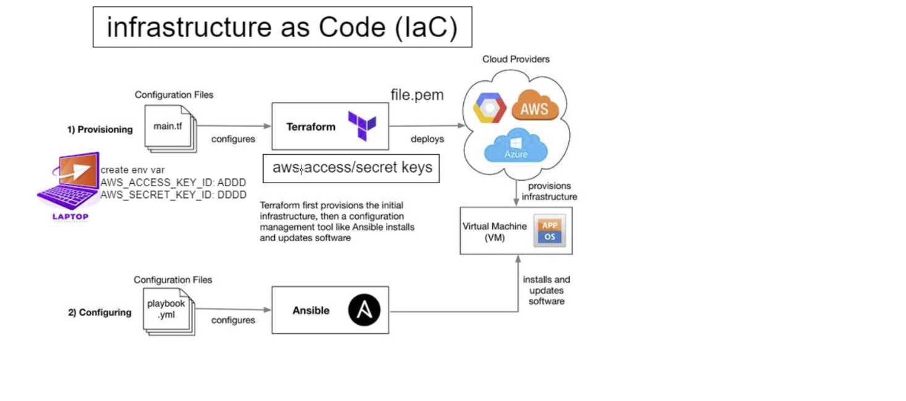

# Terraform

## What is Terraform?
Terraform is an open-source infrastructure as code tool, that allows to define and provision infrastructure resources in a declarative manner. Terraform promotes automated and consistent infrastructure deployment across various cloud providers and other infrastructure platforms.

## Why use Terraform?
1) Terraform makes it easy to version, review and manage changes to the infrastructure.
2) It supports multiple cloud providers and other infrastructure platforms. This allows to manage resources consistently across different environment.
3) Terraform keeps track of the state of the infrastructure which means it allows to track resource changes throughout your deployments.
4) Terraform allows to organise code into reusable modules, making it easier to maintain and share configurations across different projects.

## The benefits of using Terraform
* Faster provisioning and updates infrastructure resources
* Consistency and reliability in deployments
* Improved collaboration between development and operations teams
* Infrastructure is version-controlled and can be reviewd and audited
* Cost-effective management of resources

## Who is using Terraform
* HashiCorp (the creator of terraform)
* Cisco
* IBM
* Reddit
* Accenture

## Terraform Architecture

Terraform can provision resources in the cloud from simple declarative code using main.tf file. With the right key access, Terraform can communicate with cloud providers to create resources such as virtual machines with specified settings: vpc, subnets or security groups.

After using Terraform to create virtual machines (resources), Ansible can then use playbooks to provide infrastructure to the fresh virtual machines.

### Terraform Workflow
1) Define: Provide IaC in a Terraform configuration file with all the required blocks
2) Initialise: Initialise the Terraform working directory and download necessary plugins: `terraform init` command
3) Review: Review the Terraform execution plan to see what changes will be made to the infrastructure: `terraform plan` command to show the actions
4) Apply: Appy the changes to create or modify the infrastructure: using: `terraform apply`
5) Inspect: Inspect the state of the infrastructure using the Terraform state file  

## How to install Terraform on Windows
1) https://developer.hashicorp.com/terraform/downloads
2) Select Operating Systems: *Windows*
3) Download the latest version
4) Unzip the file
5) Add environment variable to path     
   
   

6) Check version: `terraform --version`
   
   