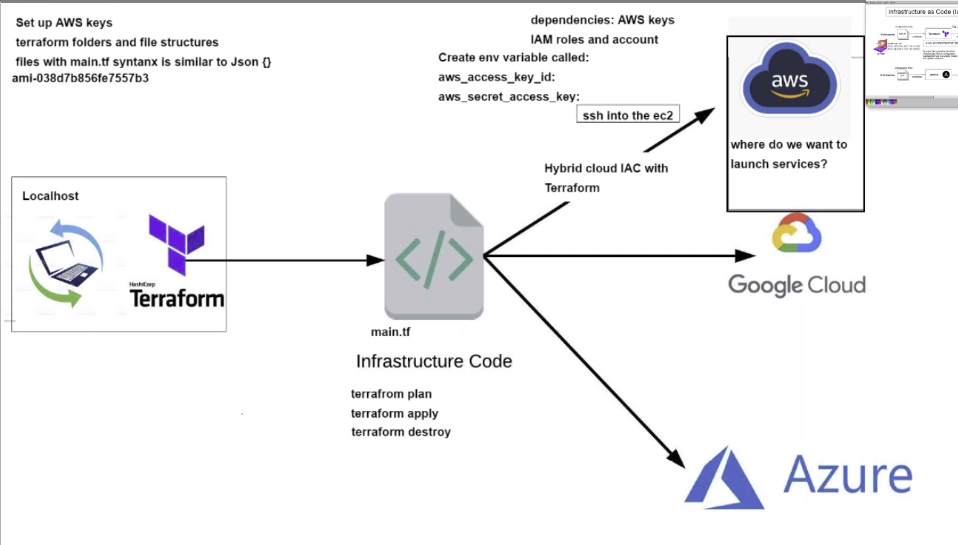

# Create ec2 instances on AWS using Terraform



1) Create environment variables 
   1) *aws_access_key_id*
   2) *aws_secret_key_id*
2) Create a folder for *terraform*
3) Create *main.tf*

    ```
    # launch an ec2 instance
    # Which cloud provider - aws
    # terraform downloads required dependencies
    # terraform init

    # provider name
    provider "aws"{
        # which part of the aws: Ireland
        region = "eu-west-1"
    }

    # Launch an ec2 in ireland
    resource "aws_instance" "app_instance" {

    # which machine/os version etc..: AMI-id
    ami = "ami-0943382e114f188e8"

    # what type of instance: t2 micro
    instance_type = "t2.micro"

    # is the public id required
    associate_public_ip_address = true

    # what would you like to name it? tech241-parichat-terraform-app
    tags = {
        Name = "tech241-parichat-terraform-app"
    }

    }
    ```

4) Preview the actions terraform would take; also can check if there's any errors
   ```
   terraform plan
   ```

5) Execute the plan
   ```
   terraform apply
   ```

6) Destroy everything in the main.tf (can comment out what not needed to be destroyed)
   ```
   terraform destroy
   ```