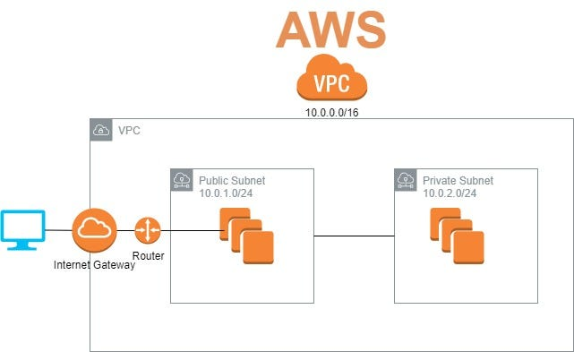

# Create ec2 instances on AWS using Terraform


1) Create environment variables 
   1) *aws_access_key_id*
   2) *aws_secret_key_id*
2) Create a folder for *terraform*
3) Create *main.tf*

4) Preview the actions terraform would take; also can check if there's any errors
   ```
   terraform plan
   ```

5) Execute the plan
   ```
   terraform apply
   ```

6) Destroy everything in the main.tf (can comment out what not needed to be destroyed)
   ```
   terraform destroy
   ```

## VPC



[How to set up VPC manually on AWS](https://github.com/jungjinggg/tech241_aws/blob/main/create_vpc.md)

### CIDR
1. VPC: 10.0.0.0/16
2. Public subnet: 10.0.2.0/24
3. Private subnet: 10.0.3.0/24

